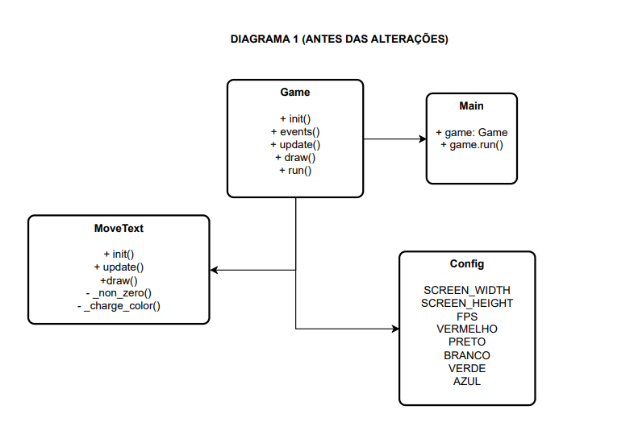
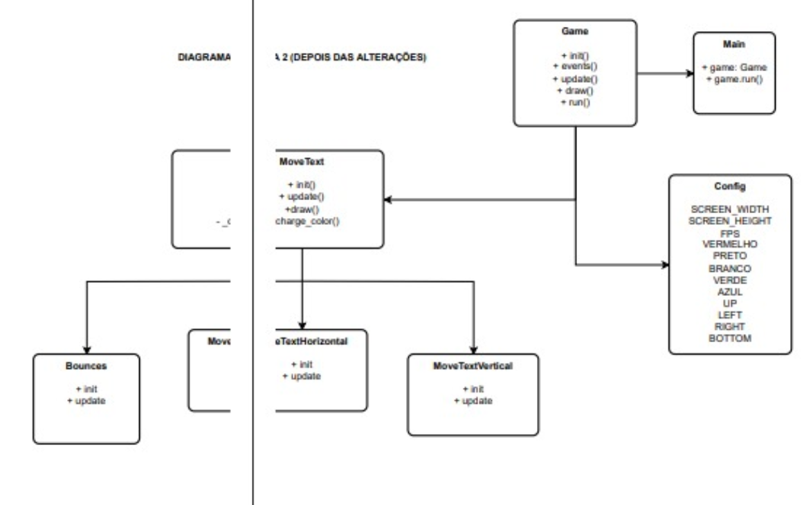

# trabalho_refatoracao

## TRABALHO DE REFATORAÇÃO

### o seguinte trabalho foi desenvolvido pelos alunos Donovan Teixeira, Fernando Dal Vesco e Gabriel Camillo Cardoso

### Este projeto nada mais é que uma game que simula a tela de DVD que marcou a infância de muitas pessoas, onde ao bater na borda ele muda de direção e solta um som de grito, além de tocar uma musica de fundo onde a mesma pode ser pausada ou trocada pela segunda musica

### Para pausar a musica precione: space
### Para mudar a musica precione: S

### Primeiro diagrama: 

### Segundo diagrama: 
